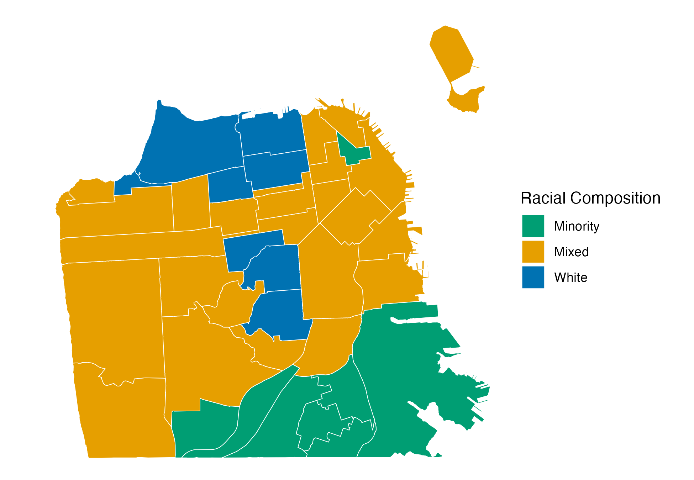
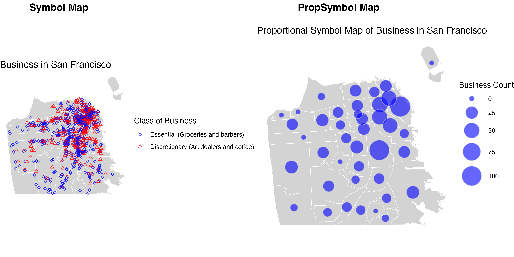

```{r setup, echo = FALSE, include=FALSE}
knitr::opts_chunk$set(echo = TRUE)
library(sf)
library(ggplot2)
library(dplyr)
library(here)
library(tibble)
library(tidyr)
library(knitr)
```

```{r 1. [Code] Import San Francisco neighborhood boundaries and neighborhood-level demographic attributes data, echo = TRUE, include = FALSE}

# Import polygons
sfnh <- st_read("data/sfnh.geojson", quiet = TRUE) #San Francisco “Analysis” Neighborhood boundaries
cult_dist <- st_read("data/cultural_district.geojson", quiet = TRUE) #Designated cultural districts in San Francisco

# Import attributes
sfdem <- read.csv("data/sfnh_dem.csv") #Neighborhood-level demographic attributes
sfbiz <- read.csv("data/sfbiz_by_type.csv") #Retail businesses by type in San Francisco
```

```{r 2. [code] Join attributes to neighborhood boundaries, echo = TRUE, include = FALSE}

sf_joined <- merge(
  x = sfnh,            # sf object; the returned object will be of the same type as x.
  y = sfdem,           # data frame
  by.x = "nhood",      # x identifier
  by.y = "nhood",      # y identifier
  all.x = TRUE         # keep all lines
)

# Validate geometries
sf_joined <- st_make_valid(sf_joined)
```

```{r 3. Create a neighborhood racial typology with three neighborhood categories, echo = TRUE, include = FALSE}

# Create neighborhood racial typology
sf_joined <- sf_joined %>%
  mutate(
    nh_rt = case_when(
      pwhite > 70 ~ "White",
      pwhite > 30 & pwhite <= 70 ~ "Mixed",
      pwhite <= 30 ~ "Minority",
      TRUE ~ NA  # Default case
    )
  )
```

```{r 4. Create a typology map displaying this variable, echo = TRUE, include = FALSE}

# Map 1: Neighborhoods by race
map_racial_typology <- ggplot(data = sf_joined) +
  geom_sf(aes(fill = nh_rt), 
          color = "white") +
  scale_fill_manual(values = c("White" = "#0072B2", "Mixed" = "#E69F00", "Minority" = "#009E73")) +  
  theme_minimal() +
  theme_void() +
  labs(
    #title = "Neighborhood Racial Typology",
    #caption = "Source: Demographic data",
    fill = "Racial Composition"
  )

# Save the map
ggsave(
  filename = "map_racial_typology.png", 
  plot = map_racial_typology,
  path = "output"
)

```


##### 5. [text] Discuss neighborhood racial typology in San Francisco in your text document.\





\
Figure 1 illustrates the racial composition of San Francisco neighborhoods. The localization of these neighborhoods are not random, the concentration of population in certain areas are often explained by a combination of historical, economic, cultural, and social factors. 

The eight neighborhoods highlighted in green are categorized as minority-dominated and are primarily concentrated in the southeastern area of San Francisco. These areas include Bayview-Hunters Point and Visitacion Valley, which are historically known for their high-proportion of non-white populations, including Asian, African-american, and Latino communities. However, Chinatown located in the northeastern of San Francisco, stands out as a minority neighborhood surrounded by a mixed neighborhoods.

The twenty-five neighborhoods highlighted in orange have a relatively balanced composition and are concentrated mainly in the central areas of San Francisco. Some of the neighborhoods in this area are Mission District, Bernal Heights, and Potrero Hill.

Lastly, the remaining eight neighborhoods, are mainly inhabited by white population and are concentrated at central and northen parts of San Francisco. Some examples are Pacific Heights, Seacliff, and Castro/Upper Market.


```{r 1. Convert the business data to a spatial object with geometries, echo = TRUE, include = FALSE}
# Transform lat/long data into sf oject
sf_sfbiz <- st_as_sf(sfbiz, 
                     coords = c("longitude", "latitude"), 
                     crs = 4326)
```

```{r 2. Create a point map using symbology, echo = TRUE, include = FALSE}

# a. Based on the “biz_type” variable, create a new variable classifying “art” (art dealers) and “coffee shop” as “discretionary” businesses and “grocery” and “barber” as “essential” businesses.

# Create a new classification variable
sf_sfbiz <- sf_sfbiz %>%
  mutate(
    biz_class = case_when(
      biz_type %in% c("art", "coffee") ~ "Discretionary",  # Discretionary businesses
      biz_type %in% c("grocery", "barber") ~ "Essential",       # Essential businesses
      TRUE ~ NA                                             # Default category
    )
  )

sf_sfbiz$biz_class <- factor(sf_sfbiz$biz_class, levels = c("Essential", "Discretionary"))

# b. Visualize how discretionary vs. essential businesses are distributed in San Francisco using symbols.
# Add more symbology details
class_map <- ggplot() +
  # display neighborhood boundaries as a layer
  geom_sf(data = sfnh,
          fill = "lightgray",
          size = 0.02,
          color = "white"
          ) +
  # add businesses as another layer
  geom_sf(data = sf_sfbiz,
          aes(color = biz_class,
              shape = biz_class,
              size = biz_class), 
          alpha = 0.8) +
  scale_color_manual(values = c("Essential" = "blue", "Discretionary" = "red")) +     
  scale_shape_manual(values = c("Essential" = 5, "Discretionary" = 24), 
                     labels = c("Essential" = "Essential (Groceries and barbers)",
                       "Discretionary" = "Discretionary (Art dealers and coffee)")) +           # set labels
  scale_size_manual(values = c("Essential" = 1, "Discretionary" = 1.5)) + 
  guides(color = "none",
         size = "none",
         shape = guide_legend(override.aes = list(
           color = c("blue", "red"), 
           size = c(1, 1.5), 
           shape = c(5, 24)
           ))) +
  theme_void() +
  labs(title = "Business in San Francisco",
       shape = "Class of Business")

# Save the map
ggsave(
  filename = "class_map.png", 
  plot = class_map,
  path = "output"
)
```

```{r 3. [code] Perform spatial join and aggregate the number of businesses at the neighborhood level, echo = TRUE, include = FALSE}

# Before joining, check if they have the same projections
st_crs(sfnh) == st_crs(sf_joined)

# Perform spatial join
nh_joined <- st_join(x = sfnh, # join
                     y = sf_sfbiz, # target
                     join = st_contains, # does x(polygon) contains y(point)?
                     left = TRUE) # keep all neighborhoods

# Aggregate the number of businesses at the neighborhood level
biz_counts <- nh_joined %>%
  st_drop_geometry() %>%
  group_by(nhood) %>% 
  summarise(n_biz = sum(!is.na(company))) # don't count NA as 1

# Join the data to have all the necessary information in one dataset
biz_colors <- sfnh %>%
  left_join(biz_counts,
            by = "nhood")

st_write(biz_colors, "processed-data/agg_bizz.geojson", driver = "GeoJSON", delete_dsn = TRUE)
```

```{r 4. Create a proportional symbol map, visualizing the distributions of businesses in San Francisco, echo = TRUE, include = FALSE}

# Create neighborhood centroids
nh_cent <- st_centroid(sfnh)

# Join the restaurant counts to neighborhood centroids
biz_symbols <- nh_cent %>%
  left_join(biz_counts, by = "nhood") %>%
  arrange(desc(n_biz)) # sort to ensure small points would be plotted in front of big points

# Create the proportional symbol map
prop_map <- ggplot() +
  geom_sf(data = sfnh,           # add a base map layer of boundaries
          fill = "lightgray",
          size = 0.02,
          color = "white"
          ) +
  geom_sf(data = biz_symbols,
          aes(size = n_biz),      # add a layer of symbols sized based on the restaurant counts 
          shape = 21,             # specify a circle shape for symbols
          fill = "blue",           # set a color to fill the shape 
          alpha = 0.6,            # set a level of transparency
          color = "lightgray") +  # set a color for edges of the shape
  scale_size(range = c(3, 13)) +  # set min and max for the size of the symbols
  theme_void() +
  labs(size = "Business Count",
       title = "Proportional Symbol Map of Business in San Francisco") 

# Save the map
ggsave(
  filename = "prop_map.png", 
  plot = prop_map,
  path = "output"
)
```

```{r 5. Combine the symbology map and the proportional symbol map into one figure and save, echo = TRUE, include = FALSE}
combined <- ggpubr::ggarrange(class_map, prop_map, nrow=1, ncol=2,
                  labels = c("Symbol Map", "PropSymbol Map"))

ggsave(
  filename = "combined_plot.png", 
  plot = combined, 
  path = "output", 
  width = 10, 
  height = 5
)
```

##### 6. [text] Insert your map into the text document. Discuss the pros and cons of each map. Combining information from both maps, describe the patterns of local businesses in San Francisco. \



\
Even though both maps are denoting a quantitative measure of businesses in San Francisco, the granularity of information we can extract from each one differs. The Proportional Symbol Map makes it easy to identify neighborhoods with the highest concentration of businesses and provides a clear understanding of the total number of businesses. For example, it is evident that most businesses are concentrated in the northeastern part of San Francisco, with neighborhoods containing between 50 to 100 businesses. However, having a number for a geographical place do not give enough information of where in the neighborhood these businesses are located. In contrast, the Symbol Map serves the purpose of identifying where businesses are distributed but does not provide specific information on their total counts in each neighborhood. If a more detailed look at the exact locations of businesses within a neighborhood is needed, the Symbol Map is useful as it provides localized information. 

From these maps, it is clear that most businesses are concentrated in mixed and predominantly white areas. In the more affluent neighborhoods, there is a higher proportion of discretionary businesses compared to minority-dominated neighborhoods. This may indicate that business owners strategically locate discretionary businesses, such as art dealers and coffee shops, in areas where they expect higher willingness to pay for such goods and services. On the other hand, businesses located in minority neighborhoods predominantly consist of essential businesses, such as grocery stores and barbers.This concentration of essential businesses in minority neighborhoods could present challenges for residents. First, the limited variety of goods and services available might restrict consumer choices, potentially leading to higher prices due to reduced competition. Second, it may place additional pressure on residents’ mobility patterns, forcing them to travel to other areas to access a broader range of products and services.

hinatown is an exception among minority neighborhoods, exhibiting a high density of businesses. However, it remains unclear whether these businesses are predominantly essential or discretionary. A decomposition of business counts by type is needed to answer this more granular question. In general, minority neighborhoods show significantly fewer discretionary businesses, which raises questions about economic opportunities and urban planning strategies. 


```{r 1. Calculate distances between each neighborhood and cultural district and identify the nearest neighbor, echo = TRUE,include = FALSE}
# Check the boundaries
ggplot() +
  geom_sf(data = sfnh, fill = NA, color = "black", size = 0.2) + 
  geom_sf(data = cult_dist, 
          aes(fill = district_name),
          color = "white", size = 0.02) +    
  theme_void() +
  labs(title = "Cultural Districts in San Francisco")

# Find out if neighborhoods intersect with any BIDs
intersections <- st_intersects(biz_colors, cult_dist)
print(intersections)

# Create a new binary variable indicating whether a neighborhood intersects with any BIDs
biz_colors$intersects_cbd <- sapply(intersections, 
                                    function(x) ifelse(length(x) > 0, 1, 0))

# Create centroids for both neighborhood polygons and community benefit district polygons
nh_centroids <- st_centroid(sfnh)
bids_centroids <- st_centroid(cult_dist)

# Compute pairwise distances (matrix form)
distances <- st_distance(nh_centroids, bids_centroids)

# Convert to a data frame for easier manipulation
distance_df <- as.data.frame(as.matrix(distances))

# Add meaningful column and row names
colnames(distance_df) <- cult_dist$district_name 
rownames(distance_df) <- sfnh$nhood

# Reshape to a long-format for analysis
distance_long <- distance_df %>%
  rownames_to_column("Neighborhood") %>% # convert row names into a new column
  pivot_longer(
    cols = -Neighborhood,          # pivot all columns except "Neighborhood"
    names_to = "Cultural District",              # names of the  column will become values in "BID"
    values_to = "Distance"         # values will go into "Distance" column
  )

# Identify nearest distance BID
nearest_bid <- distance_long %>%
  group_by(Neighborhood) %>%
  slice_min(order_by = Distance)

# Join the distance data to the existing neighborhood-level spatial data
biz_colors <- biz_colors %>%
  left_join(nearest_bid, 
            by = c("nhood" = "Neighborhood"))

# Add the distance variable using apply function
biz_colors$min_distance_to_cult_dist <- apply(distances, # use distances matrix
                                        1,   # apply to rows
                                        min) # get minimum

# Drop geometry to create simple tables
biz_colors_wo_geo <- st_drop_geometry(biz_colors)
sf_joined_wo_geo <- st_drop_geometry(sf_joined)
biz_sf_joined <- left_join(biz_colors_wo_geo, sf_joined_wo_geo, by = "nhood")

```

```{r 2. For Bayview Hunters Point, Outer Richmond, Potrero Hill, and Castro/Upper Market neighborhoods, create a table consisting of the name of the nearest cultural district, the distance, and the share of each racial group, echo = TRUE, include = FALSE}
table <- biz_sf_joined %>% 
  filter(nhood == "Bayview Hunters Point" | nhood == "Outer Richmond" | 
        nhood == "Potrero Hill"  | nhood == "Castro/Upper Market") %>% 
  mutate(nhood = case_when(
      nhood == "Castro/Upper Market" ~ "Castro/ Upper Market",
      TRUE ~ nhood # Keep all other neighborhood names unchanged
      )) %>% 
  select(nhood, `Cultural District`, min_distance_to_cult_dist:phisp) %>% 
  arrange(min_distance_to_cult_dist) 

```


##### 3. [text] Insert the table of four San Francisco neighborhoods created above into the text document. Discuss their nearest cultural districts and their racial compositions.\


```{r 3. Insert the table of four San Francisco neighborhoods created above into the text document. Discuss their nearest cultural districts and their racial compositions, echo = FALSE, include = TRUE}

table %>%
  knitr::kable(format = "markdown", 
               col.names = c("Neighb.", "Cultural District", "Distance to Cultural District (m)",
                             "White Population Proportion", 
                             "Black Population Proportion",
                             "Asian Population Proportion",
                             "Hispanic Population Proportion"),
    caption = "Nearest Cultural Districts and Racial Compositions of Selected Neighborhoods in San Francisco") 
               
```
The four neighborhoods presented in Table 1 represent a diverse mix of demographic profiles, including predominantly Black, predominantly White, and racially mixed neighborhoods. 

Bayview Hunters Point: This neighborhood is predominantly Black (45.3%) and has the shortest distance to its closest cultural district, the African American Arts & Cultural District. The proximity suggests a strong geographical and cultural connection, potentially indicating the district’s role in preserving and celebrating the history, traditions, and community functions of the Black population in the area.

Castro/Upper Market: Predominantly White (77.1%), this neighborhood’s nearest cultural district is the Castro LGBTQ Cultural District. Due to the dataset’s lack of information on gender identities or sexual orientations, it is unclear whether the residents of Castro/Upper Market could be closely tied to the district. This raises questions about whether the district effectively serves its purpose of fostering and uniting the LGBTQ+ community or if it primarily acts as a historical or symbolic space.
 
Potrero Hill: While this neighborhood has a majority White population (59.4%), its closest cultural district is the Calle 24 Latino Cultural District, with the Hispanic population in the neighborhood accounting for only 11.2%. Further analysis is needed to determine whether this cultural district was established before or after a gentrification process. Understanding these dynamics could shed light on whether the Latino or Hispanic community has been displaced from this area over time or if they still engage with the cultural district.

Outer Richmond: This is a racially mixed neighborhood, with nearly equal proportions of Asian (45.3%) and White populations (45.0%), and its closest cultural district is the Sunset Chinese Cultural District. While the significant Asian population likely contributes to the maintenance and preservation of this district, it would be interesting to explore whether the White population has been increasing in recent years. Investigating these dynamics could provide insights into phenomena such as demographic shifts, cultural assimilation or preservation, or gentrification.

